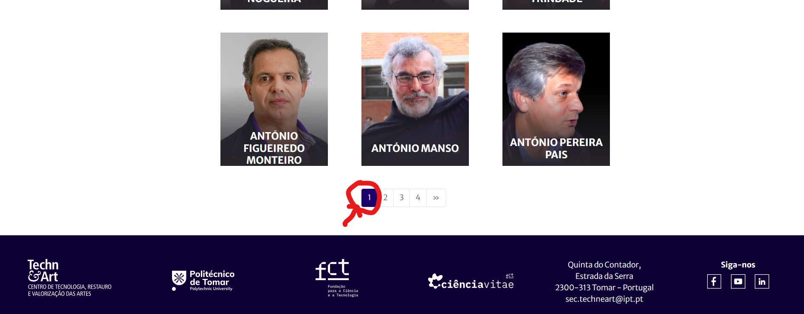

# TC-Exploratório–Investigadores Integrados 

**Objetivo:**  
Explorar a pesquisa de investigadores e a paginação; observar comportamento com termos válidos e inválidos.

**Scope:**  
- Página “Equipa” → “Integrados”
- Campo de pesquisa
- Paginação de resultados

**Tempo sugerido:** 5 min

** Ideias de Teste:**  
- Termos parciais 
- Termos inexistentes
- Navegação entre páginas (p.ex. 1 ↔ 4)
- Carregamento de imagens 

**Notas da Sessão (Resultados):**  
- ✅ Pesquisa por **“Manso”** encontra o investigador (funciona com termo parcial)  
- ✅ **Paginação** navega corretamente entre páginas  
- ⚠️ Pesquisa por nome inexistente (ex.: **“Louis”**) não retorna resultados e não surge mensagem de feedback ao utilizador.
- ⚠️ Algumas imagens de perfil não carregam (ex.: investigadora Carla Ravasco), sendo apresentado um ícone de imagem não carregada.”

**Riscos / Observações:**  
- Ausência de aviso “Sem resultados” pode levar o utilizador a pensar que a pesquisa não aconteceu.
- Imagens de perfil em falta reduzem a credibilidade do portal e prejudicam a apresentação profissional dos investigadores.

**Evidências:**  
-
-
-
-
-

**Follow-ups:**  
- Criar BUG-INV-001 (Falta de mensagem “Sem resultados”)
- Criar BUG-INV-002 (Imagens inconsistentes – algumas carregam, outras não)
