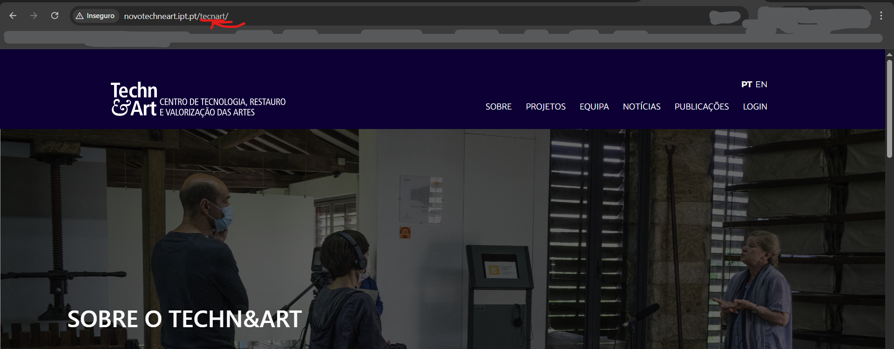

# TC-HomePage-001 – Validar abertura da homepage

**Categoria:** Teste Funcional (Smoke Test)

**Pré-condições:**  
- O utilizador tem acesso a um browser (Chrome) com ligação à internet.  

**Passos:**  
1. Abrir o browser.  
2. Navegar para `http://novotechneart.ipt.pt/tecnart/`.  
3. Observar o URL da página.  

**Resultado Esperado:**  
- O URL deve conter o texto "tecnart/", indicando que a homepage abriu corretamente.

**Resultado Obtido:**  
- O URL carregado foi `http://novotechneart.ipt.pt/tecnart/`.
- O critério esperado (contém "tecnart/") foi cumprido.
  
**Evidência:**  
- 

**Data da execução:**  
- 05/09/2025  

**Status:**  
- ✅ Passou  

