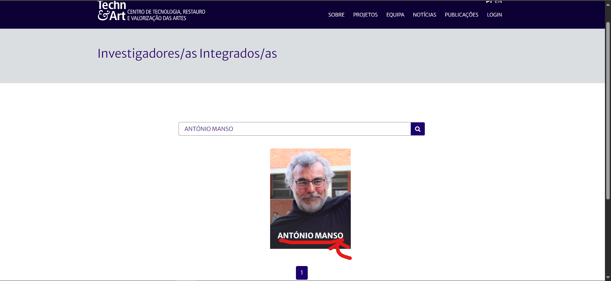

# TC-Investigador – Validar pesquisa de Investigador Integrado

**Categoria:** Teste Funcional (Fluxo de Utilizador)  

**Pré-condições:**  
- O utilizador tem acesso a um browser (Chrome) com ligação à internet.  
- O portal Techn&Art está disponível.  

**Passos:**  
1. Abrir o browser.  
2. Navegar para `http://novotechneart.ipt.pt/tecnart/`.  
3. No menu, passar o rato sobre **Equipa**.  
4. Clicar em **Integrados**.  
5. Na paginação, clicar na **página 4**.  
6. Na barra de pesquisa, escrever **"ANTÓNIO MANSO"**.  
7. Clicar no botão da lupa (pesquisa).  
8. Observar os resultados da pesquisa.  

**Resultado Esperado:**  
- Deve aparecer um **cartão de investigador** contendo o nome **"MANSO"**.  

**Resultado Obtido:**  
- Foi exibido o cartão com o nome **"ANTÓNIO MANSO"**, conforme esperado.  

**Evidência:**  
  

**Data da execução:**  
- 05/09/2025  

**Status:**  
- ✅ Passou  
