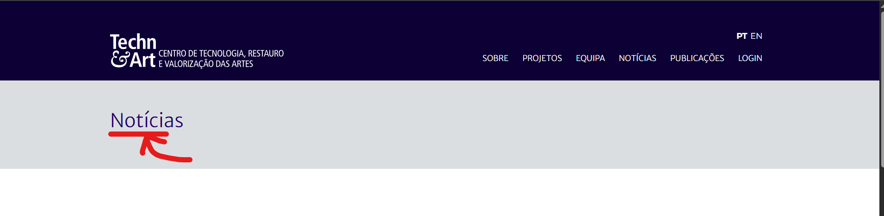

# TC-Noticias-002 – Validar título da página Notícias

**Categoria:** Teste Funcional  

**Pré-condições:**  
- O utilizador tem acesso a um browser (Chrome) com ligação à internet.  
- O utilizador está na homepage do portal Techn&Art.  

**Passos:**  
1. Abrir o browser.  
2. Navegar para `http://novotechneart.ipt.pt/tecnart/`.  
3. No menu de navegação, clicar em **Notícias**.  
4. Observar o título da página.  

**Resultado Esperado:**  
- A página de Notícias deve apresentar o título **"Notícias"** visível (elemento `<h3>`).  

**Resultado Obtido:**  
- O título exibido foi **"Notícias"**, conforme esperado.  

**Evidência:**  
  

**Data da execução:**  
- 05/09/2025  

**Status:**  
- ✅ Passou  
