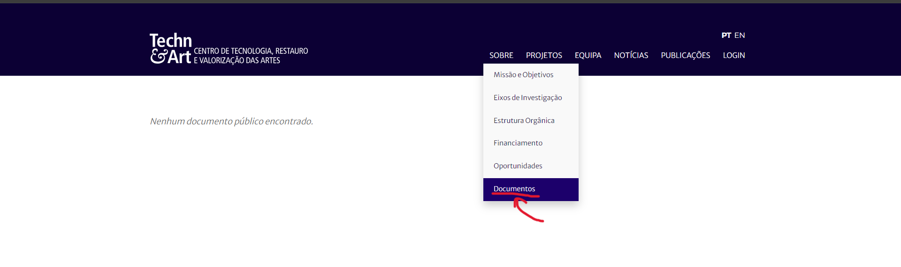
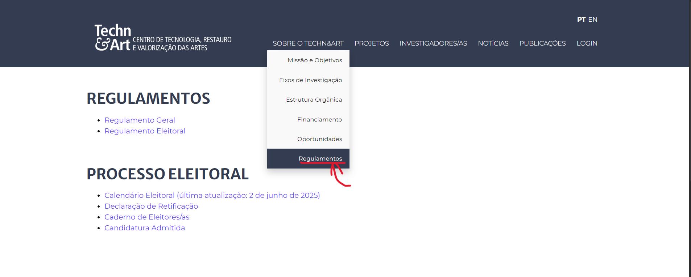

# TC-Regressão-Documentos – Validar acesso à página Documentos

**Categoria:** Teste Funcional (Regressão)  

**Pré-condições:**  
- O utilizador tem acesso a um browser (Chrome) com ligação à internet.  
- O portal Techn&Art está disponível.  

**Passos:**  
1. Abrir o browser.  
2. Navegar para `http://novotechneart.ipt.pt/tecnart/`.  
3. No menu principal, passar o rato sobre **Sobre**.  
4. Clicar em **Documentos**.  
5. Observar o conteúdo da página.  

**Resultado Esperado:**  
- A página de Documentos deve ser aberta corretamente.  
- Devem estar listados os documentos públicos disponíveis.  

**Resultado Obtido:**  
- A página de Documentos abriu.  
- Foi exibida a mensagem **“Nenhum documento público encontrado”** (não há documentos no momento).  

**Evidência (atual):**  
  

**Data da execução:**  
- 05/09/2025  

**Status:**  
- ✅ Passou (funcionalidade disponível, mas sem documentos listados)  

---

**Histórico da funcionalidade:**  
- Anteriormente, o menu apresentava a opção **“Regulamentos”**, que apontava para o ficheiro `Regulamento.pdf`.  
- Após atualização do sistema, essa opção foi substituída por **“Documentos”**.  

**Evidência (antes da alteração):**  

